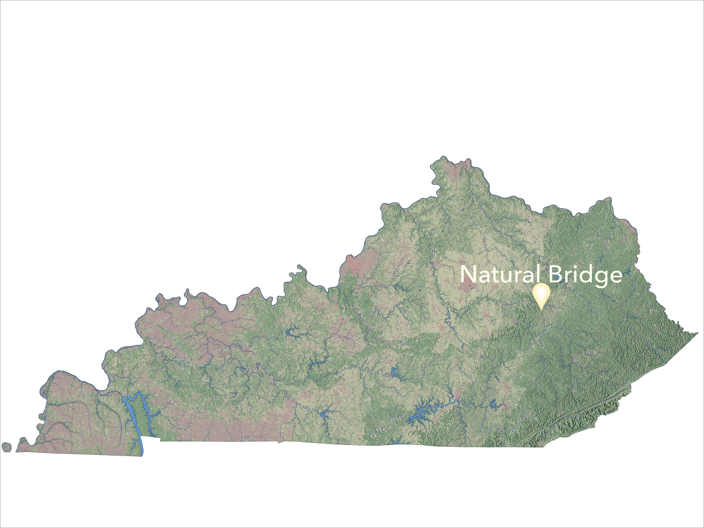

<!-- # Natural_Bridge
Natural Bridge Portfolio
Website: https://gmadd89.github.io/Natural_Bridge/ -->

<!DOCTYPE html>
<html>
<title>Natural Bridge</title>
<meta charset="UTF-8">
<meta name="viewport" content="width=device-width, initial-scale=1">
<link rel="stylesheet" href="css/w3.css">
<body>

<!-- Navbar (sit on top) -->

  

    <a href="#home" class="w3-bar-item w3-button"><b>Natural Bridge</b> at Red River Gorge</a>
    <!-- Float links to the right. -->
    

      <a href="#about" class="w3-bar-item w3-button">About Natural Bridge</a>
      <a href="#maps" class="w3-bar-item w3-button">Maps</a>
      <a href="#contact" class="w3-bar-item w3-button">Contact Me</a>
    

  

<!-- Begin page content -->

<!-- Header -->
<header class="w3-display-container w3-content w3-wide" style="max-width:1200px;" id="home">
  
  

  

</header>

<!-- Begin page content -->

  <!-- About Section -->
  

    <h3 class="w3-border-bottom w3-border-light-grey w3-padding-16">About Natural Bridge</h3>
    
 Natural Bridge is a Kentucky Natural Landmark. Formed by a sandstone arch, this bridge sits 65 feet above the ground and is approximately 78 feet long. Due to its size, scenic views, and accessibility, it is one of the most popular spots in Red River Gorge, Natural Bridge State Park. Check it out here!
    

  

  <!-- Project Section -->
  

    <h3 class="w3-border-bottom w3-border-light-grey w3-padding-16">Natural Arch Exploration</h3>
  

  

    
 <!--see https://www.w3schools.com/w3css/w3css_grid.asp -->
      <a href="page1.html" class="w3-hover-grayscale"> <!-- makes image into a link -->
      

        
Animation of Natural Arch

        
      

    </a> <!-- end link -->
    

    
 <!--see https://www.w3schools.com/w3css/w3css_grid.asp -->
      <a href="page2.html" class="w3-hover-grayscale"> <!-- makes image into a link -->
      

        
Virtual Tour of Natural Arch

        
      

    </a> <!-- end link -->
    
  
    
 <!--see https://www.w3schools.com/w3css/w3css_grid.asp -->
      <a href="page3.html" class="w3-hover-grayscale"> <!-- makes image into a link -->
      

        
Site Map of Natural Arch

        
      

    </a> <!-- end link -->
    
  
  

  <!-- Contact Section -->
  

    <h3 class="w3-border-bottom w3-border-light-grey w3-padding-16">Contact Me</h3>
    
Contact Me

    
Greg Madden

    
Univesity of Kentucky

    
Department of Geography

    
Email: gma242@uky.edu

    
Louisville, Kentucky

  

<!-- Footer -->
<footer class="w3-center w3-blue-gray w3-padding-16">
  
Powered by <a href="https://www.w3schools.com/w3css/default.asp" title="W3.CSS" target="_blank" class="w3-hover-text-green">w3.css</a>

</footer>

</body>
</html>
